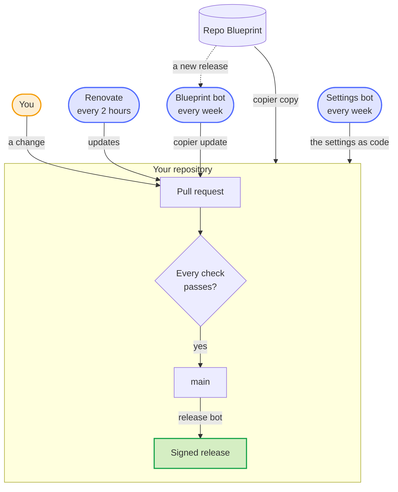
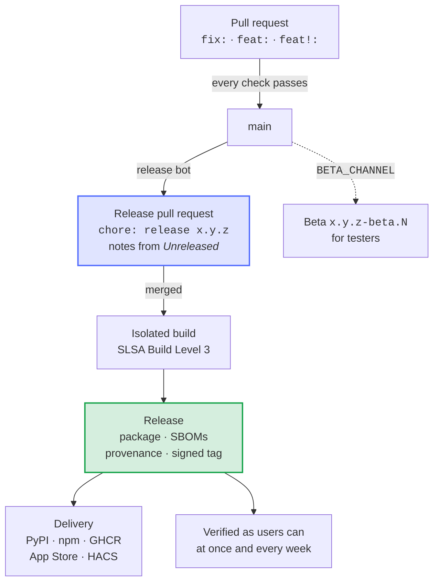
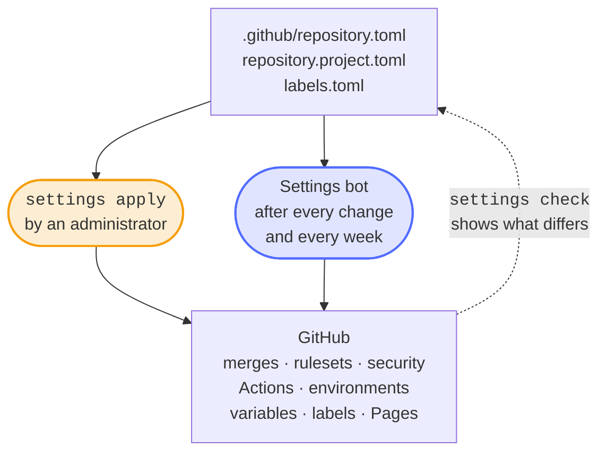
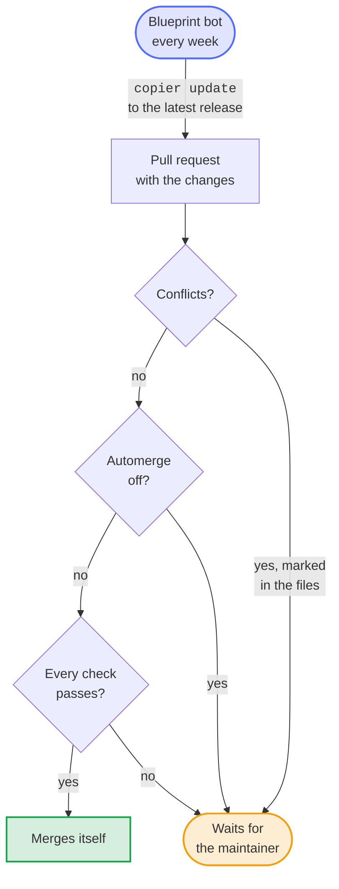
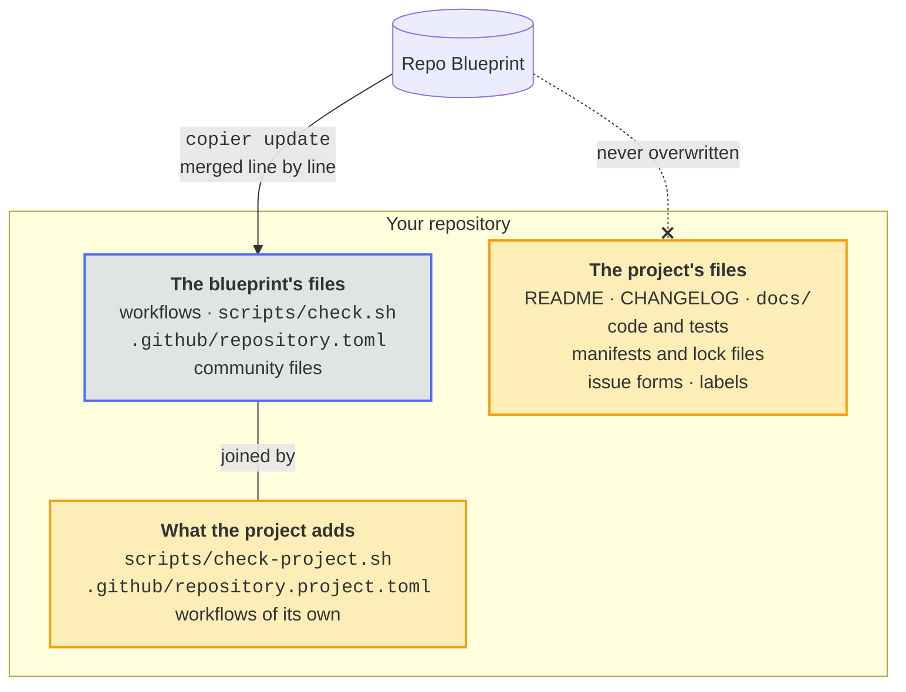
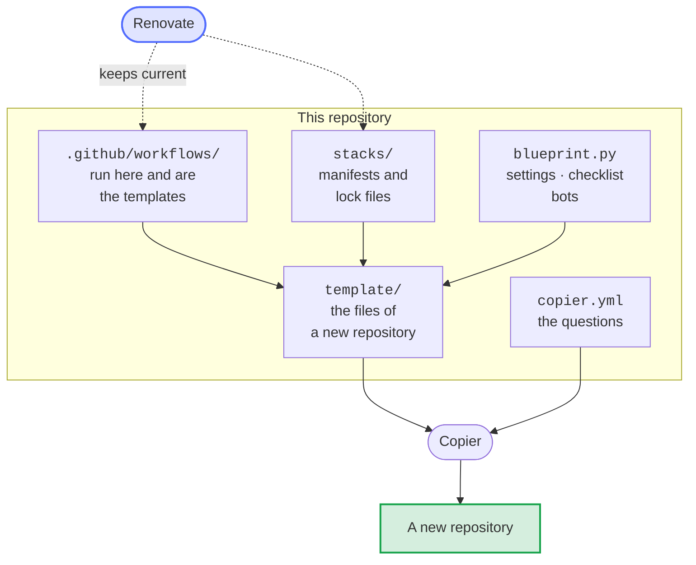

# Repo Blueprint

[](https://dennis-otto.github.io/repo-blueprint/)
[](https://github.com/Dennis-Otto/repo-blueprint/actions/workflows/ci-python.yml)
[](https://github.com/Dennis-Otto/repo-blueprint/actions/workflows/variants.yml)
[](https://github.com/Dennis-Otto/repo-blueprint/actions/workflows/codeql.yml)
[](https://scorecard.dev/viewer/?uri=github.com/Dennis-Otto/repo-blueprint)
[](https://www.bestpractices.dev/projects/15284)
[](https://api.reuse.software/info/github.com/Dennis-Otto/repo-blueprint)
[](https://github.com/Dennis-Otto/repo-blueprint/blob/main/LICENSE)
[](https://github.com/sponsors/Dennis-Otto)


A [Copier](https://copier.readthedocs.io/) template for GitHub repositories that look after themselves: tests on every change, a release bot, security checks, an issue assistant and the settings of the repository as code, for seven kinds of projects. A bot brings every repository made from it up to each new release of the blueprint.

The [website of the blueprint](https://dennis-otto.github.io/repo-blueprint/) has this guide in English and German, together with the roadmap, the security design, the decisions and the dashboard.

<sub>💛 If the blueprint is useful to you, you can [support its development](https://github.com/sponsors/Dennis-Otto). [Deutsche Fassung](https://github.com/Dennis-Otto/repo-blueprint/blob/main/README.de.md).</sub>

## How a repository looks after itself

<!-- --8<-- [start:loop] -->

Every change, yours or a bot's, is a pull request that merges once every check passes, and the release bot makes a signed release of what reaches `main`; three bots keep the repository current on their own. In the pictures, blue is the blueprint and its bots, orange is you and what is yours, and green is what comes out.



<!-- --8<-- [end:loop] -->

## What a new repository gets

| Area | What runs | How |
| --- | --- | --- |
| **Checks** | `scripts/check.sh` on every change, the same locally and in the CI: tests with full coverage, types, lint, packaging | the tools of each kind of project, hash-pinned |
| **Lint** | the workflows (actionlint), the license of every file (REUSE), the Markdown of every document (markdownlint), hints at the spelling in English and German (cspell) and at the style of the English (Vale) of the changed documents, the sign-off of every commit (DCO), the title of every pull request (Conventional Commits), an entry under *Unreleased* for every change for users | `lint.yml`, `pull-request-title.yml` |
| **Security** | CodeQL, OpenSSF Scorecard, dependency review, secret scan, SBOMs as SPDX and CycloneDX, OpenVEX, release tags signed without a key (gitsign), findings watcher, the security audit of the workflows (zizmor), every lock file against the OSV database (OSV-Scanner), the network traffic of every job (Harden-Runner) | every action pinned to a commit hash |
| **Releases** | a pull request with the next version, decided from the titles of the merged pull requests (`fix` a patch, `feat` a minor, `!` a major version), and the text of *Unreleased* in the changelog as its notes; merging it publishes the release with its package, SBOM and the signed provenance of an isolated build (SLSA Build Level 3), delivers it, and then verifies it as its users can, also every week; where the repository variable `BETA_CHANNEL` is true, every change for users also becomes a beta of the next release, a prerelease for testers | release-please, the release app, immutable releases, `verify-release.yml` |
| **Dependencies** | Renovate, which the blueprint runs for every repository every two hours as the release app: the actions, the dependencies, the images and the pins of the workflows, a week after their release, and an update that fixes a vulnerability at once; routine updates and releases of dependency updates merge themselves once every check passes. Dependabot keeps the Features of the dev container. | `renovate.json5`, `renovate-blueprint.json5`, `dependabot.yml` |
| **Coverage** | one comment on every pull request with the coverage of its tests against that of `main`, file by file | `after-checks.yml` |
| **Mutation tests** | every week, thousands of small changes of the code run against the tests, and the summary shows the share they notice and the mutants that survive; a report, never a failure | `mutation.yml`: mutmut, Infection |
| **Flaky tests** | a test run that fails runs its failed jobs once more; a job that passes then is reported as flaky in one issue | `after-checks.yml` |
| **Issues** | a first analysis of every new issue by an AI that only reads, labels, duplicates, reminders, and closing with the release that ships the fix | the [issue assistant](https://github.com/Dennis-Otto/issue-assistant) |
| **Community** | README, contributing guide with the coding standards and the rule that every change brings its tests, code of conduct, security policy with how to verify a release and an assurance case, the security design of the software (`docs/security.md`), support, governance with the roles and the continuity of the project, issue forms, pull request template, records of the decisions that shape the project (`docs/decisions/`), discussions with forms for questions and ideas and an announcement of every release, sponsor button, social preview | |
| **Website** | the documentation in `docs/` as a website with search and a light and a dark theme, in English and, with German pages such as `index.de.md` next to the English ones, in German: every pull request builds it strictly, every change of `main` publishes it on GitHub Pages | MkDocs with the Material theme, `mkdocs.yml`, `docs.yml` |
| **Settings** | the settings of the repository as code: merges, rulesets, security, Actions, environments, variables, labels, GitHub Pages, and every file of the community standards of GitHub; the settings bot applies them after every change and every week | `.github/repository.toml` and `blueprint.py` |
| **Clean-up** | every week, the branches that `main` holds and the caches of closed pull requests go; a branch with work of its own stays and is listed after a month | `cleanup.yml` |
| **Development** | a dev container for VS Code and GitHub Codespaces with the tools of the checks, and a hook that runs them before every push | `.devcontainer/`, `.githooks/pre-push` |
| **Updates** | every week, the blueprint bot runs `copier update` and opens a pull request | `blueprint-update.yml` |
| **App Store** | for a Nextcloud app: the registration of its id with its certificate, once, by hand | `register-app.yml` |
| **Upstream** | for a Nextcloud app, every week: when Nextcloud has a new major version, a pull request raises `max-version` and merges itself once every check, the end-to-end tests included, passes against it | `upstream.yml` |
| **Area labels** | every pull request gets the labels of the areas whose files it changes, by the paths in `.github/labeler.yml`, which belongs to the project | `area-labels.yml` |
| **Branches** | after every change of `main`, the branch bot brings each pull request that waits for auto-merge up to date, so that it merges once its checks pass | `update-branches.yml` |

### From a change to a release

The title of a pull request decides the next version, and merging the release pull request does the rest:



## Kinds of projects

| Kind | Stack | Checks | Delivery |
| --- | --- | --- | --- |
| Home Assistant integration | Python 3.14, pytest-homeassistant-custom-component | Ruff, mypy, tests, HACS, hassfest | a zip asset for HACS |
| Nextcloud app | PHP 8.2, Composer | php-cs-fixer, Psalm with its taint analysis, PHPUnit with every line covered | signed package to the App Store |
| GitHub Action | Python 3.12 of the runner, composite action | Ruff, mypy, tests, a run of the action | release tags and a moving major tag |
| Python package | Python 3.12, Hatchling | Ruff, mypy, tests, build | PyPI, trusted publishing |
| Node package | Node 24, TypeScript | tsc, node:test with full coverage, pack | npm with provenance |
| Container image | Alpine by digest | Hadolint, build, self-test | GHCR, multi-arch, with SBOM and provenance |
| Repository without a build | | text files, shell scripts | releases only |

Every kind starts with a small working example and its tests: replace it with the real code.

## Start a repository

<!-- --8<-- [start:quick-start] -->

Copier 9.4 or later, Git, the GitHub CLI and a checkout of the blueprint (for `blueprint.py`):

```sh
copier copy gh:Dennis-Otto/repo-blueprint my-project
cd my-project
git init && git add --all && git commit --signoff --message "chore: start from the blueprint"
gh repo create Dennis-Otto/my-project --public --source . --push
python3 ../repo-blueprint/blueprint.py settings apply
python3 ../repo-blueprint/blueprint.py checklist
```

Copier asks for the name, a one-sentence description, the kind of project, the license (MIT, MIT-0, BSD-3-Clause, Apache-2.0, GPL-3.0-or-later or AGPL-3.0-or-later) and a few details of the kind. `settings apply` sets everything the API can set; `checklist` shows what is left for a person, such as the secrets, and which steps are done.


<!-- --8<-- [end:quick-start] -->

### Once per repository

- **The release app** opens the release and update pull requests, so that their checks run. Install it on the repository, and set its private key as the secret `RELEASE_AUTOMATION_PRIVATE_KEY` of the environment `release`. The app needs the permissions *Administration*, *Checks*, *Commit statuses*, *Contents*, *Issues*, *Pages*, *Pull requests* and *Workflows* (read and write), and *Actions*, *Dependabot alerts*, *Environments*, *Secrets* and *Variables* (read): with them the settings bot applies the settings as code and Renovate updates the dependencies. Renovate gets a token without *Administration*.
- **The issue assistant** needs `CLAUDE_CODE_OAUTH_TOKEN` in the environment `issue-assistant`.
- **Delivery:** trusted publishing on PyPI or npm, the app certificate of a Nextcloud app, or the HACS submission, as the checklist says.

`checklist` prints the `gh secret set` commands; the value is typed into the prompt of the GitHub CLI and never appears anywhere else.

### An existing repository

An existing repository takes the blueprint on a branch, in one pull request:

1. `copier copy --overwrite --vcs-ref vX.Y.Z --data sample_code=false gh:Dennis-Otto/repo-blueprint .` with the answers that fit the repository, without the sample code and tests of a new one, such as its description, topics and homepage as they are on GitHub, so that `settings apply` changes nothing there. The files of the project (README, changelog, code, tests, manifests, labels, issue forms, icons) stay as they are.
2. Look at the diff of every file of the blueprint and put back what belongs to the project only: sections of SECURITY.md or CONTRIBUTING.md, rules of Renovate (in `.github/renovate.json5`), hosts of the issue assistant, ignore rules. `copier update` keeps these changes from then on.
3. Write the version of the latest release into `version.txt` and `.release-please-manifest.json`, start `CHANGELOG.md` with `## Unreleased`, and give `.github/labels.toml` the labels of the bots (`autorelease: pending`, `autorelease: tagged`, `merge-conflict`, `maintenance`, `docker`).
4. Put the checks of the project alone, such as its end-to-end tests, into `.github/repository.project.toml` and `scripts/check-project.sh`; remove the workflows, scripts and tests that the blueprint replaces, and delete files of the template that the project doesn't need, such as a sample test. A repository without `docs/` has no website until it writes `docs/index.md`; `mkdocs.yml` shows how German pages join it.
5. Open the pull request. Once its new checks pass, `blueprint.py settings apply` switches the required checks, the variables and the labels, and the pull request can merge.

## Settings as code



`.github/repository.toml` holds the settings of a repository; `blueprint.py settings check` compares them with GitHub and `settings apply` makes GitHub match:

- **Repository:** squash merges with the title of the pull request, auto-merge, branch updates, deleted branches, signed-off web commits, no wiki or projects.
- **Security:** immutable releases, private vulnerability reporting, Dependabot alerts with the security updates of Renovate, secret scanning with push protection.
- **Actions:** read-only tokens by default, no approvals by workflows, actions pinned to commit hashes, approval for the workflows of every outside contributor.
- **Rulesets:** *Protect main* (pull requests only, squashed, linear history, every required check, no deletion or force push) and *Release tags* (`v*.*.*` never moves).
- **Variables and environments:** `PUBLISH_TO`, the release app, and environments that only `main` may use, with the secrets they need.
- **Pages:** GitHub Pages publishes the website that the Docs workflow builds.

`blueprint.py` needs Python 3.12 and the GitHub CLI signed in as an administrator, and nothing else. It never reads or prints the value of a secret. Every repository has a copy in `.github/blueprint.py` and `.github/blueprint/`, and the settings bot (`settings.yml`) compares its settings with the settings as code every week and after every change of them, so that no repository drifts.

## Updates



The blueprint bot (`blueprint-update.yml`) runs `copier update` every week. Without conflicts its pull request merges itself once every check passes; conflicts stay in it as markers for the maintainer. The repository variable `BLUEPRINT_AUTOMERGE` set to `off` makes every update wait for the maintainer. Run it by hand under *Actions → Blueprint update*, or locally with `copier update`.

The blueprint owns the workflows, `scripts/check.sh` and the community files: their changes arrive with the updates. Files that belong to the project are never overwritten: the README, the changelog, the security design in `docs/security.md`, the dependency manifests and lock files (Renovate keeps them current), the code and the tests, the website's `mkdocs.yml` and pages, the issue forms, the labels and their paths, and accepted findings. Checks of a project alone belong in `scripts/check-project.sh`, which `scripts/check.sh` runs last.

## What belongs to a project



The blueprint keeps the shared parts of every repository equal; a project adds its own without forking them:

- **Changes in the blueprint's files survive updates:** `copier update` merges the changes of the blueprint with those of the repository, line by line, and marks a conflict only where both changed the same lines.
- **Settings of the project alone** go into `.github/repository.project.toml`, such as the checks of its end-to-end tests or an environment with its secrets. `blueprint.py` and the settings bot add them to `.github/repository.toml`.
- **Checks of the project alone** go into `scripts/check-project.sh`, which `scripts/check.sh` runs last; **workflows of the project alone** are workflow files of their own.
- **Several copyright holders,** such as the authors of a fork, are the answer `copyright`, separated by semicolons; LICENSE and REUSE.toml name each of them.
- **Files under another license,** such as third-party artwork, get a `.license` file next to them, as REUSE describes.
- **The package of a Nextcloud app** is checked by `scripts/check-package.sh ARCHIVE unsigned|signed` if the project has one: `scripts/check.sh` runs it on the package that krankerl builds, the release on the package before and after signing.
- **The version in other lines of a file of the release,** such as the tag in the URL of a screenshot in `appinfo/info.xml`, follows each release when the line ends with the comment `x-release-please-version`, such as `<!-- x-release-please-version -->`.

## Tools in every repository

- `bash scripts/check.sh`: the checks of the CI, locally.
- `bash scripts/social-preview.sh`: renders `.github/social-preview.html` into the 1280×640 image that GitHub shows for links to the repository; upload it under *Settings → Social preview*.

## Dashboard


[The dashboard](https://dennis-otto.github.io/repo-blueprint/dashboard/) shows every public repository of the owner at a glance: the release of the blueprint it is on, its latest release and the pull request of the next one, its open pull requests and those in conflict, the last run of its main workflows on `main`, and its OpenSSF Scorecard; a second table shows the health of each: the line coverage and the share of mutants that the tests catch, the stable releases and the median time to the first answer to an issue over 90 days, and the median time of the CI, each with an arrow when it moved since a week ago, from the history that the published dashboard keeps. The Dashboard workflow builds it with `dashboard.py` every six hours and publishes it on GitHub Pages, under the website of the blueprint, which is this documentation. It shows only what is public anyway, no finding of code scanning and no alert of Dependabot.

Every Monday, the Weekly report workflow posts in the [discussions](https://github.com/Dennis-Otto/repo-blueprint/discussions) what the public repositories of the owner released, merged and fixed in the week: their releases, merged pull requests and the updates among them, opened and closed issues, failed runs on `main` and the median time of their CI (`weekly.py`). Like the dashboard, it reports only what is public.

## How the blueprint works



- `copier.yml` holds the questions. `template/` holds the files of a new repository; a file or folder name such as `[% if stack == 'php' %]composer.json[% endif %]` carries its condition, and a name that renders empty is left out. The delimiters `{= =}` and `[% %]` appear in no workflow, script or manifest, so `${{ }}` of GitHub Actions and `[[ ]]` of Bash and TOML stay as they are.
- The workflows in `.github/workflows/` run in this repository and are the templates of the workflows of every new repository: actionlint lints them and Renovate keeps their actions current here. A line marked *Not in the blueprint itself* switches a job off in this repository and disappears in new ones.
- `blueprint.py` starts the tool of the settings as code, the checklist and the bots. Its code is in `blueprint/`, a module for each task, with a `ruff.toml` of its own, so that the Ruff settings of a project don't apply to it.
- `stacks/` holds the dependency manifests and lock files of each kind of project, which Renovate keeps current; a new project starts from them.
- `tests/` checks `blueprint.py` against a simulated GitHub and renders every kind of project; the Variants workflow renders each one and runs its own checks with its real tools, and also updates a repository of each kind from the latest release to the commit, which must bring every file of the blueprint as a new repository has it and pass the same checks.
- `docs/` makes this documentation the website of the blueprint: its pages include the READMEs, and the Dashboard workflow publishes them with the dashboard under `dashboard/`.

Where the blueprint is heading: [the roadmap](https://github.com/Dennis-Otto/repo-blueprint/blob/main/docs/roadmap.md). What it protects and trusts: [its security design](https://github.com/Dennis-Otto/repo-blueprint/blob/main/docs/security.md).

Contributions are welcome: see [CONTRIBUTING.md](https://github.com/Dennis-Otto/repo-blueprint/blob/main/CONTRIBUTING.md). Questions and problems: [SUPPORT.md](https://github.com/Dennis-Otto/repo-blueprint/blob/main/SUPPORT.md). Report vulnerabilities privately, as [SECURITY.md](https://github.com/Dennis-Otto/repo-blueprint/blob/main/SECURITY.md) describes.

## License

[MIT No Attribution](https://github.com/Dennis-Otto/repo-blueprint/blob/main/LICENSE): repositories made from the blueprint owe it nothing, not even a notice. Every file names its license in the machine-readable form of [REUSE](https://reuse.software).
