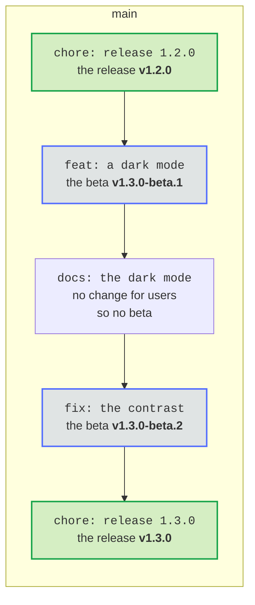

# Publish a beta of the next release after every change for users, where a project wants it

- Status: accepted
- Date: 2026-10-07

## Context

Testers of a Home Assistant integration want the changes before a release, in HACS, without installing from a branch.

## Options

1. A release candidate by hand, with `Release-As` in a pull request.
2. A beta of the next release after every `feat`, `fix` or `perf` that reaches `main`, as a prerelease.

## Decision

Option 2, switched on by the repository variable `BETA_CHANNEL`. The beta takes the version of the release pull request with `-beta.N`, is built, signed and verified like a release, and is published as a prerelease that announces nothing. release-please finds its last release by the version of its manifest, so the betas change neither the next version nor its notes.

## Consequences

A project with the beta channel has a tag and a prerelease for every change for users. HACS, npm and PyPI offer them only to those who ask for betas.
