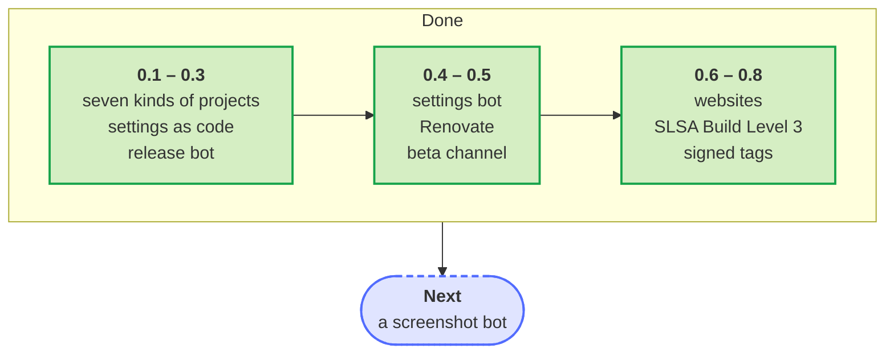

# Roadmap

Where the blueprint is heading in the next twelve months, until October 2027, and what it will not do. It is a direction, not a promise: the needs of the repositories made from it set the order. Ideas are welcome as [feature requests](https://github.com/Dennis-Otto/repo-blueprint/issues/new?template=feature_request.yml) or in the [discussions](https://github.com/Dennis-Otto/repo-blueprint/discussions).

## Done

The [changelog](https://github.com/Dennis-Otto/repo-blueprint/blob/main/CHANGELOG.md) names every change of every release. The larger steps so far:

- **0.1 to 0.3:** seven kinds of projects, the settings as code, the security checks of the workflows, fuzzing and property tests, the release bot with the changelog that the pull requests write, the verification of every release, prereleases, the dev container, the dashboard and Harden-Runner.
- **0.4:** the settings bot that applies the settings as code itself, OSV-Scanner, area labels, the changelog check and the licenses of the third-party components in every release.
- **0.5:** Renovate instead of Dependabot, a beta channel, the records of decisions, the coverage of every pull request, the flaky-test bot, the SBOM as CycloneDX with an OpenVEX document, the Markdown lint and the announcement of every release.
- **0.6:** a documentation website for every repository, the build of every release in an isolated workflow (SLSA Build Level 3), release tags signed without a key, mutation tests every week, the taint analysis of Psalm for a Nextcloud app, hints at the spelling and the style of the documents, the clean-up bot, the weekly report, the health of every repository on the dashboard and the documents that the Silver level of the OpenSSF Best Practices badge asks for.
- **0.7:** the settings that every website shares, from the blueprint, and a successor that the owner designated on GitHub, who can carry the project on.
- **0.8:** websites in more than one language, issue forms that point to the documentation, and the website of the owner itself made from the blueprint.
- **OpenSSF Best Practices:** the blueprint holds [the Silver level](https://www.bestpractices.dev/projects/15284) of the badge.
- **The next release:** what the section *Unreleased* of the changelog lists.

## Next

| Topic | What it brings |
| --- | --- |
| **A screenshot bot** | Screenshots of a project that renew themselves when its interface changes |

## Always

- New versions of the dependencies and the actions, and every new major version of Nextcloud, reach the repositories through the update bots.
- Every new release of the blueprint reaches every repository made from it as a pull request of the blueprint bot.
- What GitHub adds for the security of repositories and releases is taken up when it fits, as immutable releases and their attestations were.

## Not planned

- **Forges other than GitHub.** The blueprint builds on the rulesets, environments, attestations, immutable releases and the API of GitHub.
- **Releases by hand.** Versions follow the titles of the pull requests, and the notes are the text that they write under *Unreleased*.
- **Bots that merge what nobody approved.** Only updates that pass every check merge on their own; every other change waits for a person.
- **Secrets in files.** `blueprint.py` never reads or sets the value of a secret, and no file of the blueprint holds one.
