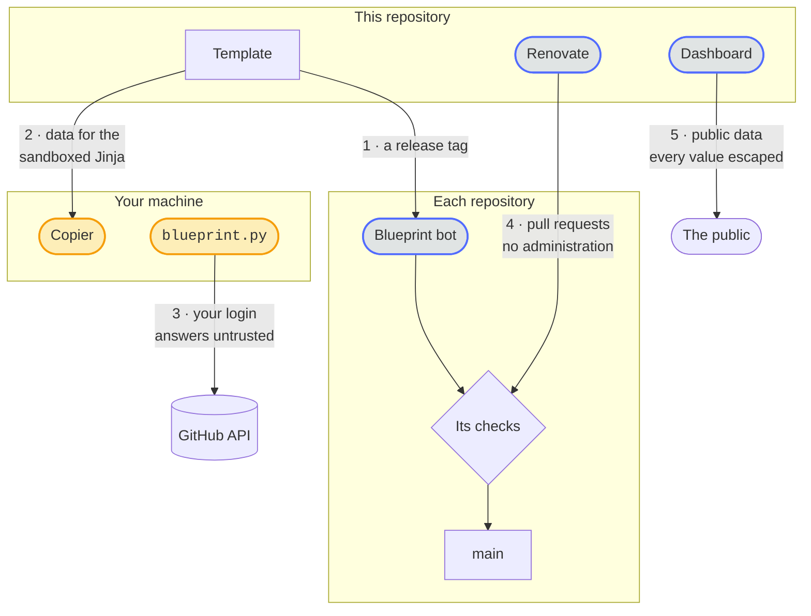

# Security design

What the blueprint protects, what it trusts and which risks remain. [SECURITY.md](https://github.com/Dennis-Otto/repo-blueprint/blob/main/SECURITY.md) says how to report a vulnerability and how to verify a release, and argues why the repositories and their releases are safe; this page covers the blueprint itself: the template, `blueprint.py` with its code in `blueprint/`, the bots that run from this repository and the dashboard.

## What you can expect

- Copying or updating a repository from the blueprint runs no code of the blueprint on your machine. The template has no tasks, migrations or Jinja extensions, so Copier renders it in its sandboxed Jinja environment and needs no `--trust`.
- `blueprint.py` never reads, prints or stores the value of a secret. It names the secrets that are missing and the `gh secret set` command that sets each one; you type the value into the prompt of the GitHub CLI.
- `blueprint.py settings apply` changes only the settings of the repository it is run in, and only those that `.github/repository.toml` names.
- A new release of the blueprint reaches a repository only as a pull request of the blueprint bot in that repository, which passes every check of the repository before it merges, or waits for the maintainer.
- The dashboard shows only what is public anyway: no finding of code scanning and no alert of Dependabot.

## What is protected

| Asset | Where it lives | Protection |
| --- | --- | --- |
| The template, which reaches every repository made from it | `template/`, `copier.yml` and the shared files of this repository | Pull requests with every required check, and the Variants workflow, which renders every kind of project and runs its checks with its real tools; a release that is not only dependency updates waits for the maintainer |
| The settings of every repository | `.github/repository.toml` of each repository | Applied only by `blueprint.py`, by an administrator or by the settings bot on `main`; the bot compares them every week, so that a weaker setting shows |
| The private key of the release app, which can write the administration of the repositories it is installed on | The secret `RELEASE_AUTOMATION_PRIVATE_KEY` of the environment `release` of each repository | Only workflows on `main` can use the environment; each job asks for a token with the permissions it needs, which expires after an hour |

## Trust boundaries

1. **This repository → every repository made from it.** The blueprint bot of each repository runs `copier update` to the latest release tag of the blueprint and opens a pull request there. The checks of that repository decide whether it merges; a conflict, or the repository variable `BLUEPRINT_AUTOMERGE` set to `off`, makes it wait for the maintainer.
2. **The template → Copier on your machine.** The template is data for Copier's sandboxed Jinja; the answers of the questions are checked by their validators.
3. **`blueprint.py` → GitHub.** It runs the GitHub CLI with the login of whoever starts it, or with the token of the settings bot, and treats every answer of GitHub as untrusted: an answer it can't read stops the run with an error.
4. **Renovate → every repository.** It runs from this repository every two hours, as the release app, with a token that can write contents, pull requests and workflows but not the administration. Its updates are pull requests that pass the checks of each repository.
5. **The dashboard → the public.** It reads public data of GitHub and publishes a static page on GitHub Pages; every value it shows is escaped.

## Threats and countermeasures

| Threat | Countermeasure | Evidence |
| --- | --- | --- |
| A harmful change of the template reaches every repository | Pull requests with every required check here; every kind rendered and checked with its real tools; a release that is not only dependency updates waits for the maintainer; in each repository, the update passes its own checks | the Variants workflow, `tests/test_template.py` |
| Copying the blueprint runs code on the user's machine | No tasks, migrations or Jinja extensions in `copier.yml` | `test_copying_runs_no_code_of_the_blueprint` in `tests/test_template.py` |
| A rendered workflow loses its pins or runs with more permissions | Every action pinned to a commit hash; the workflows of a new repository are the blueprint's own, which zizmor and actionlint audit | `test_every_action_is_pinned_to_a_commit`, `test_the_workflows_are_the_blueprints_own` |
| `blueprint.py` leaks a secret | It never reads the value of a secret; it only names the missing ones | `test_apply_sets_everything_but_the_secrets` in `tests/test_blueprint.py` |
| An unexpected answer of GitHub makes `blueprint.py` apply wrong settings | Every answer is read strictly; anything else stops the run with an error before a change | `test_errors_of_github_stop_the_run`; coverage-guided fuzzing with Atheris in `fuzz/fuzz_blueprint.py` |
| The settings of a repository are weakened by hand | The settings bot compares them with the settings as code after every change and every week, and applies them | the Settings workflow of each repository |
| The private key of the release app is abused | The environment `release` only for `main`; tokens per job with the least permissions; no administration for Renovate | `.github/workflows/renovate.yml`, `.github/repository.toml` |
| A name or a description on the dashboard runs as script | Every value is escaped before it becomes HTML | `dashboard.py` |

## Residual risks

- The maintainer's account and the private key of the release app are the keys to every repository made from the blueprint; whoever holds them can change all of them.
- A change that is wrong but passes every check reaches every repository with the next release of the blueprint. The maintainer's review of every release that is not only dependency updates is the last guard.
- Copier and the GitHub CLI run with the permissions of whoever starts them.
